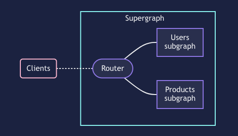

# Apollo Server

自前で GraphQL API を実装する手段として、Node.js で動く[Apollo Server](https://www.apollographql.com/docs/apollo-server/)がある

## Apollo Server で BFF を構築する

Apollo Server で BFF を構築する方法は大きく 2 通り

- サービスに応じた Resolver を実装する
- 各サービスの API を Apollo Server で実装し、Apollo Federation で単一の GraphQL API として振る舞うようにする
  - 各サービスを subgraph とし、リクエストを捌く router が BFF に相当する

### サービスに応じた Resolver を実装する

- 各サービスは REST API を提供するようにして Apollo Server を BFF とする構成が基本
  - Apollo Server が公式でサポートしている DataSource は`RESTDataSource`のみであるため
  - https://www.apollographql.com/docs/apollo-server/v2/data/data-sources/
- 必要なら任意の DataSource を実装できる（コミュニティによって作成・公開されているものもある）ため、柔軟な対応が可能

#### 構築例： TypeScript + Apollo Server v4 で構築した GraphQL API を Serverless Framework で AWS Lambda へデプロイする

公式で[AWS Lambda にデプロイする手順](https://www.apollographql.com/docs/apollo-server/deployment/lambda/)が案内されていたので、Apollo Odyssey の Lift-off で作ったサンプルアプリの API（の一部）を TypeScript で書き直してデプロイしてみた

- [Serverless Framework で Lambda + Apollo Server の環境を作りたい (zenn.dev)](https://zenn.dev/qmotas/scraps/1c7db1b96ab16b)
- 成果物 https://github.com/qmotas/odyssey-ts-serverless

スキーマ

```graphql
type Query {
  tracksForHome: [Track!]!
}

type Track {
  id: ID!
  title: String!
  author: Author!
  thumbnail: String
  length: Int
  modulesCount: Int
}

type Author {
  id: ID!
  name: String!
  photo: String
}
```

##### ハマったとことか

- [Serverless Framework のドキュメントの Getting Started](https://www.serverless.com/framework/docs/getting-started#:~:text=documentation%20instead.-,Getting%20started,-To%20create%20your)で、[公式のテンプレート](https://www.serverless.com/framework/docs/providers/aws/cli-reference/create#:~:text=create%3Acreate-,Available%20Templates,-To%20see%20a)より先に[コミュニティのテンプレート（Example）](https://www.serverless.com/examples/)が案内されていて、最終的に採用した`aws-nodejs-typescript`に辿り着けなかった
- esbuild を最新化すると serverless-esbuild がこけるので、esbuild のバージョンは 0.16.x にしておく必要がある（2023-02-17 時点、serverless-esbuild は`1.37.3`）
- GraphQL/Apollo Server の勉強に使った Apollo Odyssey は Apollo Server v3 を使っていたので、v4 へのマイグレーションガイドをちゃんと確認しないとダメだった
  - v3 は`DataSources`を`ApolloServer`のコンストラクタに渡してたけど v4 はサーバ起動時に`Context`を作ってこの中で初期化する
- `graphql-code-generator init`が JSON のパースエラーでこけていて、これが解消できなかった
  - 詳細なログが出せなかったので原因箇所は不明（`package.json`くらいしか JSON のエラーが出そうな要素がないのでこれ？）
  - `codegen.ts`は生成できていたので、それ以外（`package.json`の編集）は手作業で解決した
- Resolver Chain で親 Resolver の型がスキーマから graphql-codegen した型（子 Resolver も解決済みの最終的な形）になっていると type error が出るので、mappers というオプションで Resolver の処理中に扱う中間的な型を指定する必要がある
  - 今回のスキーマだと`Track.author`は`getTracksForHome`の Resolver の結果時点では`authorId`なので、`Track`の`author`を`authorId`に置き換えた型が必要
    - `TrackModel`型を作った
      - べた書きすると codegen の意味がないので graphql-codegen で生成した`Track`をベースにした
      - `Omit<Track, "author"> & { authorId: string }`
      - [ドキュメント](https://the-guild.dev/graphql/codegen/plugins/typescript/typescript-resolvers#use-your-model-types-mappers/)の例に倣って`TrackModel`と命名したけどあまり適切だと思っていない
        - `IntermediateTrackModel`とか`TrackUnderResolution`とか？
- 今回はシンプルなスキーマでも苦労したので、複雑なスキーマになると Resolver の型をちゃんと付けるのかなり大変なんじゃないかと思う

##### 体験がよかったとことか

- `aws-nodejs-typescript`テンプレートを使ったら out-of-the-box で TypeScript が書けた
  - serverless-esbuild プラグインのおかげっぽい
- Serverless Framework そのものも serverless-offline プラグインも特に問題なくサッと動いてくれた
  - 特にデプロイの手順が簡素で体験がよかった（AppSync の構築で使ったときも感じた）
- AppSync に比べるとローカルで実装/検証できるぶん（実装部分は Controllable なので）トラブルシュートしやすかった
  - ただこれくらいシンプルなスキーマだと慣れちゃえば AppSync の方がサッと作れると思う

### Apollo Federation で複数の GraphQL API を集約する

> 
>
> https://www.apollographql.com/docs/federation/

- 複数の subgraph と router で supergraph を構成する
- router が単一の GraphQL API として振る舞い、リクエストを捌く（BFF の立ち位置）
  - クライアントからは 1 つの API として透過的に利用できる
- subgraph は Apollo Server で実装すると federation に必要なフィールドが自動で生えるため、複雑な実装は不要
  - subgraph 間の解決に必要な entity の定義（スキーマで primary key を指定する）と専用のリゾルバ（`__resolveReference`）を実装する

#### 構築例

[Apollo Odyssey（Apollo のチュートリアル）で Apollo Federation をさわってみる(zenn.dev)](https://zenn.dev/qmotas/scraps/8317917d63fa5e)
